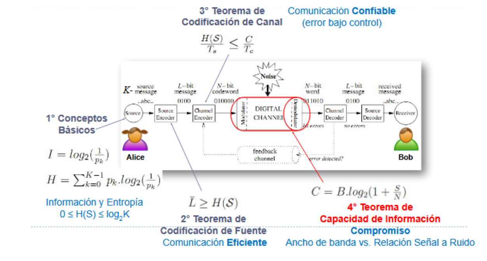

# Final 22/12/2021

1. El ancho de banda de un medio de transmisión es el rango de frecuencias que el canal puede transmitir adecuadamente. Shannon demuestra que la capacidad máxima teórica de un canal con ruido depende tanto del ancho de banda como de la relación señal-ruido (SNR).
$$
C = B \log_2(1+\mathrm{SNR})
$$
donde B es el ancho de banda y SNR la relación señal-ruido. Esta expresión indica que, aunque un mayor ancho de banda permite transmitir más información, la presencia de ruido limita la cantidad máxima de información que puede transmitirse de manera confiable.

2. La entropía de la fuente se define como la esperanza de la información que aporta un símbolo emitido de la fuente, o lo que es lo mismo, el promedio de información que esperamos obtener al observar la fuente. La fórmula es
$$
H(S) = -\sum_{i=1}^{k} P(E_i)\,\log_2 P(E_i)
$$
Es máxima cuando los símbolos son equiprobables, lo que hace que la fórmula sea
$$
H(S) = log_2(n)
$$
Un ejemplo de esto es cuando tiramos una moneda, donde la cantidad de símbolos es 2 y cada uno es equiprobable. Decimos entonces que,
$$
H(S) = log_2(2) = 1 bit
$$

3. El *delay* lo podemos descomponer en :
```
$ Delay = T_proc + T_encol + T_tx + T_prop  $
```
En particular, el RTT podemos pensarlo como 2 veces ese *Delay*. Ya que el paquete va de A -> B y pasa lo siguiente :
- Llega al router, se procesa su encabezado, errores,... eso se considera el Tiempo de procesamiento.
- Una vez procesado, el router define por cuál interfaz enrutarlo, si el canal de salida está congestionado, debe esperar y ese es el tiempo que queda encolado.
- El router comienza a enviar los bits hacia el enlace, eso se considera el tiempo de transmisión del paquete.
- Una vez que el paquete ya está en viaje, los bits viajan por el enlace hasta otro nodo, esto lo conocemos como tiempo de propagación.

(Imaginar un diagrama a partir del caminito anterior)

4. CSMA/CD (collision detection) es un protocolo de acceso al medio en el que antes de que un nodo emita una trama (capa 2 OSI) por un canal compartido, hace un censo del medio (carrier sense) y luego transmite, en caso de detectar una colisión (collison detection), avisa mediante una señal de *jam* a todos los nodos del dominio de colisión. Se hace un exponential backoff antes de retransmitir. Para el caso de CSMA/CA es un protocolo utilizado cuando el canal es wireless, esto se debe a que durante la transmisión de un nodo es difícil detectar una colisión. Por tal motivo, se intoduce una variante de CSMA, donde se sigue censando el medio, pero, si está ocupado se hace el backoof de manera preventiva (donde se elije un período de espera de manera aleatoria dentro de la Contention Window). Para este protocolo es importante el uso de acuses de recibo (ACKs) y, se suele implementar con un mecanismo llamado RTS-CTS (ready to send - clear to send) para evitar el problema de la estación oculta (ver diagrama en los resúmenes). 
Ethernet clásico (802.3) utiliza CSMA/CD y WiFi (802.11) utiliza CSMA/CA. 
Estos protocolos pertenecen a la capa de *acceso a la red* del modelo TCP/IP.
Si pensamos en CSMA/CD pensamos en un Hub, si pensamos en CSMA/CA pensamos en un Access Point

5. Decimos que el mecanismo de control de congestión en TCP es equitativo (contexto de redes donde el ancho de banda es la capacidad máxima de datos que se pueden enviar sobre un canal compartido) ya que cuando varios flujos comparten un mismo recurso de red, cada emisor ajusta dinámicamente su ventana de congestión. Así, ninguno tiende a monopolizar la capacidad disponible y el ancho de banda se reparte de forma aproximandamente justa entre las conexiones. Esto ocurre mediante el *additive increase* y el *multiplicative decrease*, es decir, que cada uno de los flujos al monitorear los acuses de recibo, infiere si puede aumentar su ventana de emisión (por cada RTT si recibe el ACK) o tiene que reducirla (por cada RTT si pierde un ACK). Con el tiempo, por más de que pueda darse una situación puntual donde uno ocupe más que otro, converge a un punto de equilibrio justo.

6. TCP envía varios segmentos sin esperar un ACK por cada uno, siendo la cantidad de datos en tránsito limitada por la ventana de congestión. En ausencia de pérdidas, la ventana crece progresivamente, permitiendo aumentar el ancho de banda utilizado. Cuando ocurre una pérdida, TCP interpreta que existe congestión y reduce la ventana, disminuyendo la tasa de transmisión. Este ciclo de crecimiento y reducción se repite continuamente, por lo que el rendimiento promedio depende del tamaño de los segmentos (MSS), del tiempo de ida y vuelta (RTT) y de la probabilidad de pérdida p. En particular, un mayor MSS aumenta el rendimiento, mientras que un RTT más alto o una mayor probabilidad de pérdidas lo reducen.

7. La idea es esquematizar una comunicación entre A -> C y B -> C donde en el primer esquema se utiliza un sistema de criptografía simétrica :

- A y C conocen la misma clave (Kac) y utilizan la misma para cifrar y descifrar los mensajes que mandan a través del canal inseguro. 
- B y C conocen la misma clave (Kbc) y utilizan la misma para cifrar y descifrar los mensajes que mandan a través del canal inseguro.

En este escenario, la ventaja la velocidad de descifrado es alta. requiere un mecanismo seguro para distribuir previamente las claves secretas.

En el contexto de un sistema de clave asimétrica, cada usuario tiene su par de claves, pública y privada. Para comunicarse,

- A cifra el mensaje con la pública de C (PubKC) y se lo envía, C lo descifra con su privada (PrivKC). C le responde cifrando con la pública de A (PubKA) y A lo descifra con su privada (PrivKA).
- B cifra el mensaje con la pública de C (PubKC) y se lo envía, C lo descifra con su privada (PrivKC). C le responde cifrando con la pública de B (PubKB) y B lo descifra con su privada (PrivKB).

En este escenario, la desventaja es el costo computacional donde el cifrado y descifrado es más lento. Y la ventaja es que no hace falta intercambiar claves por el canal inseguro. La criptografía de clave pública permite implementar mecanismos como las firmas digitales, con las que pueden obtenerse autenticidad y no repudio.

# Final 27/07/2023

2. En mi opinión, el mayor aporte de Shannon tiene origen en que la los mensajes no deben ser entendidos como su contenido semántico sino como una secuencia con propiedades estadísticas. Conceptualmente, me parece revolucionario. Por supuesto que la formalización de esto con el teorema de codificación de una fuente sin ruido, el de codificación en un canal con ruido y de capacidad son los aportes de esta idea.

3. El ancho de banda tiene dos significados para nosotros en esta materia :
- Por un lado, en términos de la teoría de la información es el rango de frencuencias medido en Hz que puede atravesar un canal sin pérdida de información (magnitud física del canal). Esto es un aporte de Shannon donde se define el límite teórico de la capacidad de transmitir información sin pérdida por un canal con ruido. 
- Por otro, cuando hablamos de TCP y la equitatividad, decimos que el ancho de banda es la tasa de transferencia (throughput) que es básicamente la cantidad de datos, medido en bits, que se transmiten por unidad de tiempo.

4. En TCP se utilizan distintos algoritmos para controlar la congestión. Recordar que tenemos mecanismos preventivos (RED) y reactivos (TCP clásico, Tahoe, Reno). Los reactivos, utilizan ciertos mecanismos como :
- *Slow start* : cuando comienza la emisión de paquetes al dispositivo compartido de red, la ventana de congestión se modifica dinámicamente. En el caso de TCP Tahoe y Reno, el tamaño crece de manera exponencial hasta alcanzar el umbral del slow start.  
- *Congestion Avoidance* : Una vez alcanzado el SSTHRESH lo que sucede es que deja de crecer exponencialmente la CWND y pasa a crecer de manera lineal (additive increase) para evitar congestionar la red.
- *Fast retransmit / fast recovery* : es un mecanismo que utiliza TCP Reno para que cuando llegan acks duplicados mostrando que hubo pérdida de paquetes, en vez de reiniciar la CWND a 1 como sucede en TCP Tahoe, tome un valor del SSTHRESH, esto permite recuperarse rápidamente ante la pérdida y no comenzar de nuevo con el ciclo de slow start.

5. El timeout en TCP es el intervalo de tiempo que el protocolo define para esperar el acuse de recibo de un paquete enviado. En caso de no recibir ese ACK en ese intervalo, se retransmite. Por ello, se conoce como RTO (retransmission time-out). Este está formado por un estimated-RTT más una *guard band* que es un intervalo pequeño de estimación. Existen varias maneras de calcular este RTO. La dificultad en capa 4 es que puede haber congestión, tiempos de encolamiento en routers,... y eso hace que el RTT sea complicado de estimar. Si miramos las funciones de densidad de probabilidad que muestrar cómo se distribuyen los tiempos de llegada de esos ACKs, veremos que es muy impredecible. Por ello, se desarrollaron algoritmos de estimación, el clásico es estimar el RTT y tomar el doble del RTT = RTO, pero eso traía problemas porque se utilizaba el dato del RTT del paquete retransmitido. El algoritmo que demostró más precisión es aquel que utiliza la varianza del RTT.

# Final 26/07/2024

1. Los escenarios que afectan la descarga son:
- El uso del ancho de banda está equitativamente distribuido entre todos los que hacemos uso del access point, con lo cual, para descargar el video o lo que sea, no voy a poder hacer uso de la totalidad del canal compartido. 
- dependiendo la distancia al access point, la señal se debilita
- interferencia de otros dispositivos
- como el servidor es remoto, la red puede estar congestionada, el servidor también, y eso puede ocasionar también demoras.

2. FTP está pensado para descargar el archivo completo antes de que el usuario pueda utilizarlo, pero Nextflix lo que hace es implementar un mecanismo de streaming y buffering donde, si bien utiliza FTP, el consumo de esa información comienza en cuanto sea útil, es decir, en cuanto se pueda reproducir el video, y mientras eso ocurre, continua con la descarga. Esto hace que no se sienta la descarga.

# Final 11/09/2024

1. TDM, FDM y contención estadística son mecanismos de acceso a un medio físico compartido. En TDM (time division multiplexing) lo que se hace es otorgar ranuras temporales a cada emisor. En FDM (frequency division multiplexing), se otorga un rango de frencuencias, un ancho de banda acotado por cada usuario. En cambio, en contención estadística, la asignación del recurso compartido ocurre de manera dinámica según si el emisor quiere transmitir, la forma de manejar la congestión es con buffers que capturan la información y la despachan mediante FCFS o Round Robin. El tema acá es que si dos emisores transmiten al mismo tiempo, puede ocurrir una colisión. Es por ello, que se implementan los protocolos de acceso al medio compartido como CSMA/CD y CSMA/CA. El primero se utiliza en Ethernet clásico (IEEE 802.3) donde todos los hosts estaban dentro del mismo dominio de colisión y las tramas podían corromperse, este mecanismo permitía que si un emisor detectaba colisión mientras transmitía mandase la señal jam y luego se hiciese el backoff. Actualmente ya no sucede ya que las redes están switcheadas, eso era cuando la topología estaba formada por hubs. Por el otro lado, CSMA/CA es un mecanismo para WiFi (IEEE 802.11) donde no siempre se puede detectar la colisión, entonces se utiliza este protocolo también de censado, pero se utilizan también acuses de recibo, CTS-RTS para el tema de la estación oculta.
En cuanto a la escalabilidad, al aumentar la cantidad de emisores, en TDM y FDM, como son fijas las cantidades asignadas, esto hace que si alguien no está haciendo uso del recurso, se subutiliza, con los cual es baja para ambos. Sin embargo, en contención estadística, como es bajo demanda, es muy escalable, hay que controlar nada más que no hayan colisiones, como vimos con los protocolos CSMA y controlar la congestión, pero va.

2. 
